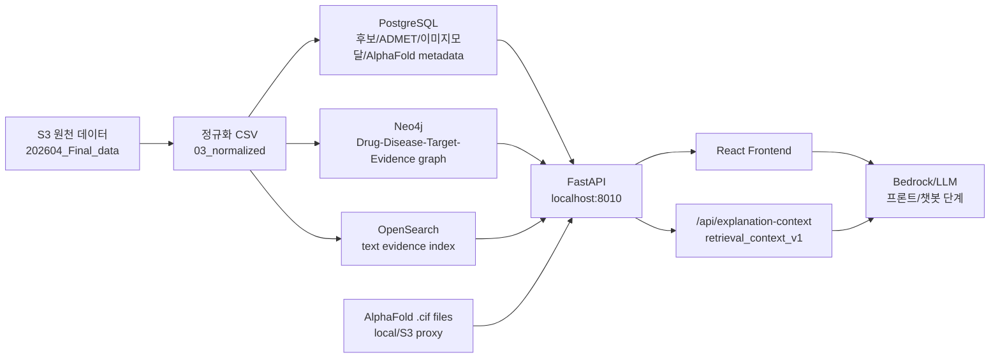
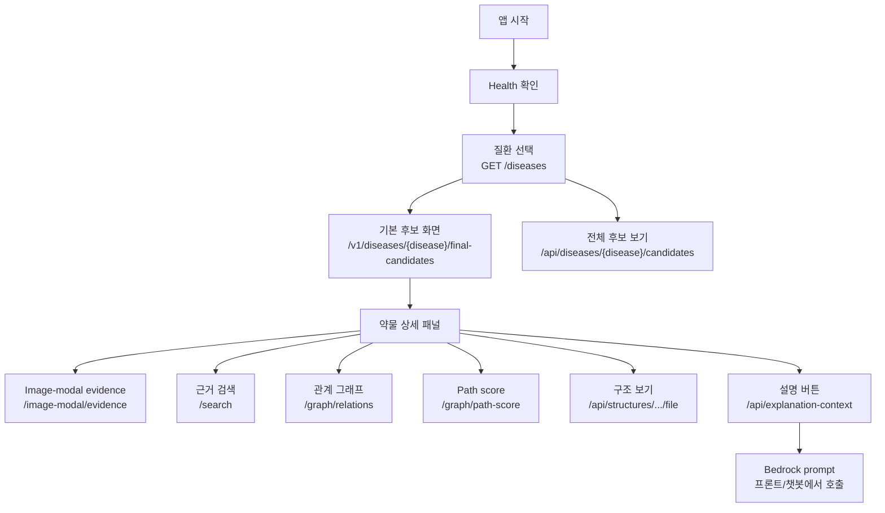

# Frontend API 전달 문서 및 전체 워크플로우 v1

작성일: 2026-05-14

## 현재 결론

백엔드/DB/API는 프론트엔드 개발자에게 전달 가능한 상태다.

```text
Frontend handoff readiness: PASS
PostgreSQL/FastAPI: 연결 완료
Neo4j graph/path scoring: 연결 완료
OpenSearch text search: 연결 완료
AlphaFold structure proxy: 연결 완료
Pipeline run control API: mock/skeleton 연결 완료
Explanation context API: Bedrock 전 retrieval JSON 연결 완료
Bedrock 실제 호출: 프론트/챗봇 단계에서 진행
```

## 전체 진행 방향

이번 작업은 아래 순서로 진행했다.

```text
1. S3 원천 데이터 확인
2. 11개 질환 기준 확정
3. PostgreSQL 정규화/적재
4. FastAPI 후보 API 구현
5. candidate_pool / final_candidates 분리
6. Neo4j graph 적재/검증
7. OpenSearch text search 색인
8. AlphaFold target/protein/structure 연결
9. Pipeline run control API mock 구현
10. RAG/Bedrock retrieval 계약 작성
11. /api/explanation-context 구현
12. 프론트 v1 QA 통과
13. 백엔드/DB 전체 무결성 검증
```

## 전체 아키텍처



## 프론트에서 우선 연결할 API

### 1. Health

```text
GET /health
GET /health/search
GET /health/graph
GET /health/kg-embedding
```

용도:

```text
화면 상단 또는 개발자 QA용 연결 상태 확인
```

## 2. 질환 목록

```text
GET /diseases
```

검증 결과:

```text
11개 질환 반환
BRCA, Colon, HNSC, IPF, Liver, LUNG, PAH, PDAC, Psoriasis, RA, STAD
OV, SKCM은 의도적으로 제외
```

## 3. 기본 후보 화면

```text
GET /v1/diseases/{disease_code}/final-candidates
```

예:

```text
GET /v1/diseases/BRCA/final-candidates
GET /v1/diseases/RA/final-candidates
```

의미:

```text
최종 후보 약물 화면
ADMET 이후 final candidate 계층
기본 Candidates 화면은 이 endpoint를 사용
```

주요 필드:

```text
candidate_id
disease_id
drug_name
rank
tier
score
target
target_pathway
safety_score
verdict
admet_status
is_final_candidate
candidate_source
```

검증:

```text
BRCA: 15개
drug_name 중복 없음
```

## 4. 전체 후보 보기

```text
GET /api/diseases/{disease_code}/candidates
GET /v1/diseases/{disease_code}/candidates
```

예:

```text
GET /api/diseases/BRCA/candidates
```

의미:

```text
view=all 전체 후보 화면
ADMET 이전/후보 pool 포함
is_final_candidate 값으로 “최종 후보 / 후보 pool 단계” 구분
```

검증:

```text
BRCA: 60개
is_final_candidate=true: 15
is_final_candidate=false: 45
drug_name 중복 없음
```

## 5. 후보/근거 검색

```text
GET /search?q={query}
GET /search?q={query}&disease_id={disease_code}
GET /search?q={query}&disease_id={disease_code}&doc_type=candidate_pool
```

지원 doc_type:

```text
candidate_pool
drug_candidate
image_evidence
image_report
```

예:

```text
GET /search?q=Oxaliplatin&disease_id=BRCA&doc_type=candidate_pool
GET /search?q=JAK&disease_id=RA
```

중복 처리:

```text
candidate_pool 검색은 기본적으로 같은 질환 안 같은 drug_name을 1개로 collapse
raw_total은 원천 OpenSearch hit 수
total은 화면 표시 hit 수
provenance_count/provenance_note로 원천 row 수 표시
```

검증:

```text
Oxaliplatin / BRCA
total: 1
raw_total: 2
provenance_count: 2
```

## 6. 이미지 모달 근거

```text
GET /image-modal/clusters?disease_id={disease_code}
GET /image-modal/evidence?disease_id={disease_code}
GET /image-modal/evidence?disease_id={disease_code}&drug_name={drug_name}
GET /image-modal/reports?disease_id={disease_code}
```

의미:

```text
WSI/CT/X-ray 이미지 자체가 아니라
이미지 모달 분석에서 나온 환자/cluster/약물 추천 근거 텍스트와 요약
```

주의:

```text
match_status=evidence_only는 최종 후보가 아니라 supporting evidence 전용 약물로 표시
cluster_label이 비어 있으면 cluster_key 표시
```

## 7. Neo4j 관계 그래프

```text
GET /graph/relations?disease_id={disease_code}&limit=50
```

예:

```text
GET /graph/relations?disease_id=RA&limit=50
```

응답 형태:

```json
{
  "disease_id": "RA",
  "nodes": [],
  "edges": []
}
```

검증:

```text
RA graph
nodes: 71
edges: 132
duplicate_node_id: 0
duplicate_edge_id: 0
```

## 8. Path scoring

```text
GET /graph/path-score?disease_id={disease_code}&limit=100
```

의미:

```text
Neo4j graph + candidate + ADMET + image-modal evidence 기반 설명 가능한 내부 기준 점수
```

주의:

```text
임상 효능 점수가 아님
path_score만 단독 표시하지 말고 components/evidence_sources/risk_sources와 함께 표시
```

## 9. KG embedding baseline

```text
GET /graph/kg-embedding?disease_id={disease_code}&model=ensemble&limit=50
```

지원 model:

```text
distmult
transe
ensemble
```

주의:

```text
KG embedding score는 graph 구조 학습 기반 보조 점수
추천 확정 근거로 단독 사용 금지
```

## 10. AlphaFold 구조 보기

Target/protein 검색:

```text
GET /api/structures/targets?q=JAK
GET /api/structures/targets?disease_id=RA
```

구조 중심 목록:

```text
GET /api/structures?q=JAK
GET /api/structures?disease_id=RA
```

구조 상세:

```text
GET /api/structures/{structure_id}
```

구조 파일 proxy:

```text
GET /api/structures/{structure_id}/file
```

대표 예:

```text
GET /api/structures/af_p23458_f1_v6/file
```

검증:

```text
JAK1/JAK2/JAK3 모두 structure_status=available
JAK1 file proxy: 200
Content-Type: chemical/x-cif
Content-Length: 1115383
```

주의:

```text
프론트 viewer는 S3를 직접 읽지 말고 backend proxy endpoint 사용
AlphaFold 구조는 약효 증명이 아니라 target/protein 참고자료
```

## 11. Explanation context API

Bedrock/LLM 설명 버튼에서 사용할 백엔드 retrieval package.

```text
GET /api/explanation-context?disease_id={disease_code}&drug_name={drug_name}
GET /api/explanation-context?disease_id={disease_code}&canonical_drug_id={canonical_drug_id}
```

예:

```text
GET /api/explanation-context?disease_id=RA&drug_name=Ruxolitinib
GET /api/explanation-context?disease_id=BRCA&drug_name=Oxaliplatin
```

의미:

```text
Bedrock 호출 전, LLM prompt에 넣을 근거 JSON을 백엔드가 조립해서 반환
```

포함 근거:

```text
final_candidate
candidate_pool provenance
ADMET
OpenSearch search_context
Neo4j path score/risk/evidence
AlphaFold structure_context
retrieval_sources
prompt_guardrails
```

검증:

```text
RA/Ruxolitinib
status: ready
retrieval_sources: 10
prompt_guardrails: 6
JAK1/JAK2/JAK3 structure context 반환

BRCA/Oxaliplatin
status: ready
candidate_pool.provenance_count: 2
retrieval_sources: 13
```

주의:

```text
Bedrock 실제 호출은 아직 없음
프론트/챗봇 레이어에서 Bedrock 호출
LLM은 /api/explanation-context 응답 JSON 안의 근거만 사용
```

## 12. Pipeline run control API

```text
POST /api/pipeline-runs/preflight
POST /api/pipeline-runs
GET /api/pipeline-runs
GET /api/pipeline-runs/{run_id}
GET /api/pipeline-runs/{run_id}/events
GET /api/pipeline-runs/{run_id}/artifacts
POST /api/pipeline-runs/{run_id}/cancel
POST /api/pipeline-runs/{run_id}/complete
```

의미:

```text
나중에 챗봇/Bedrock이 파이프라인을 직접 실행하지 않고 backend API를 호출하도록 만든 제어 계층
현재는 mock backend 중심
실제 SageMaker/Step Functions 실행은 feature flag 없이 막음
```

특수문자 alias:

```text
$ -> mock
@ -> local_agent
# -> aws_stepfunctions
```

## 프론트 권장 화면 흐름



## 프론트에 꼭 전달할 주의사항

```text
1. 기본 후보 화면은 final-candidates 사용
2. view=all은 candidates 사용
3. candidate_pool 원천 중복은 provenance 보존용이며 API에서는 dedup/collapse됨
4. 검색 결과의 raw_total/provenance_count를 함께 표시하면 혼선이 줄어듦
5. AlphaFold는 약물이 아니라 target protein 구조 보기
6. S3 구조 파일을 직접 fetch하지 말고 backend file proxy 사용
7. Explanation context는 Bedrock prompt용 근거 JSON이며 Bedrock 호출 자체는 아님
8. API 재빌드/DB 재적재 후 candidate_protein_structure_links=261 확인 필요
```

## 현재 남은 일

프론트 담당자:

```text
1. React v2 화면 구성
2. 후보/상세/검색/그래프/구조 viewer 연결
3. 설명 버튼에서 /api/explanation-context 호출
4. Bedrock prompt 구성 및 응답 표시
```

백엔드 담당자:

```text
1. 프론트 연결 중 막히는 endpoint 보강
2. EC2 배포 시 API_BASE_URL 전환 지원
3. API 재빌드 후 candidate_protein_structure_links=261 확인
4. 필요 시 /api/explanation-context filtering 옵션 추가
```
